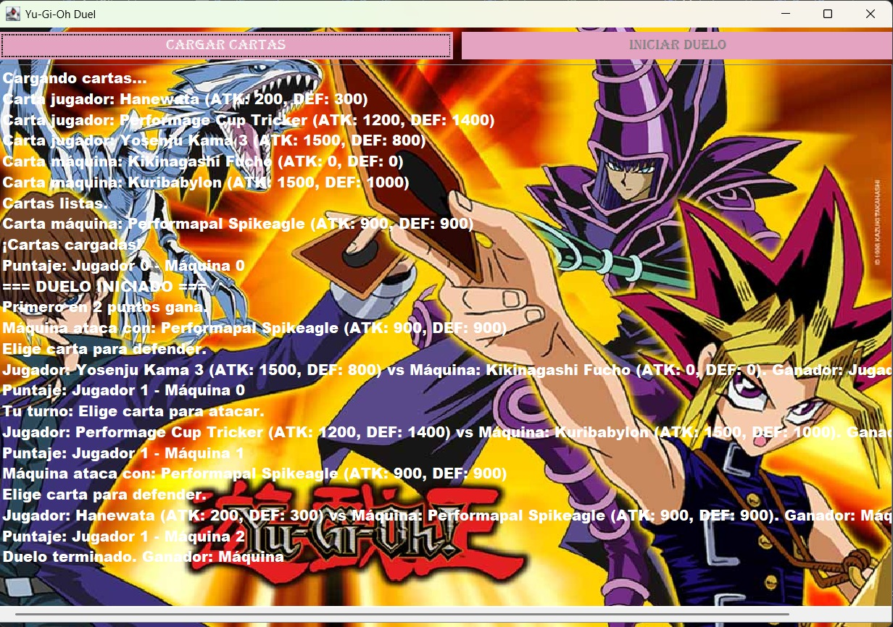

## Laboratorio 1- YU-GI-OH 
## Jhorman Ricardo Loaiza 2359710 
## Laura Camila Agudelo 2359743
# Instrucción de ejecución:

Lo primero que se debe realizar luego de ejecutar el programa es hacer click en el botón cargar cartas, para que asi se nos muestre tanto las 
de la máquina como las del jugador. Una vez se hayan cargado las cartas, debe hacer click en iniciar duelo y que inmediatamente se habiliten 
los botones de las cartas del jugador y el usuario pueda seleccionar la carta con la que desea defenderse. Ya luego de seleccionar la primera 
carta pues el juego va mostrando el ganador de la partida y los puntos acumulados y así sucesivamente hasta que uno de los dos complete los 2
puntos y sea el ganador de la partida.
## Explicación de diseño:
El diseño de este laboratorio está hecho de forma que todo el código esté bien organizado y fácil de mantener. La clase ApiClient cumple un 
papel muy importante porque es la encargada de conectarse con la API oficial de Yu-Gi-Oh! para traer cartas aleatorias. Lo interesante es que 
no descarga cualquier tipo de carta, sino que filtra solo las que son del tipo Monster. Este proceso lo hace usando peticiones HTTP y luego 
convierte los datos recibidos (que vienen en formato JSON) en objetos Card que el juego puede usar directamente. Además, tiene un sistema de 
intentos que evita errores de conexión o respuestas vacías, lo que le da más estabilidad al funcionamiento general.
Por otro lado, la clase DuelFrame es la que se encarga de toda la parte visual. Aquí se diseña y arma la interfaz gráfica del juego con Swing, 
dándole un estilo más dinámico y agradable a la vista. Se incluye una imagen de fondo que ocupa toda la pantalla, y los paneles y etiquetas se 
vuelven transparentes para que el fondo no se pierda. También se organizan los botones principales, las cartas del jugador, las de la máquina y 
el área donde se muestra el registro de la batalla. Todo esto se hace cuidando que la interfaz sea intuitiva, estética y funcional, para que la 
experiencia del usuario sea más inmersiva y ordenada.
Finalmente, la clase Main es la que pone todo en marcha. Primero intenta aplicar el estilo visual del sistema operativo para que el programa se 
vea más natural, y luego crea el DuelFrame, inicia la lógica del juego con DuelGame y finalmente muestra la ventana. Además, el diseño usa una
interfaz llamada BattleListener, que se encarga de manejar los eventos principales del duelo, como los turnos, los puntajes, los errores o el 
final del juego. Gracias a esto, el código queda más modular, fácil de entender y de mejorar en el futuro. 
En resumen, el laboratorio combina una buena estructura lógica con una interfaz atractiva y un manejo eficiente de la información proveniente de la API. 

